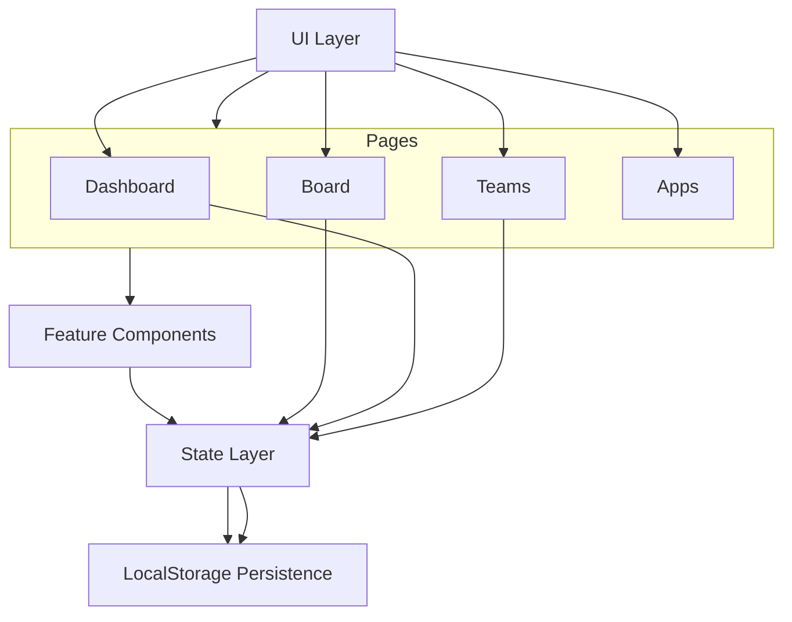
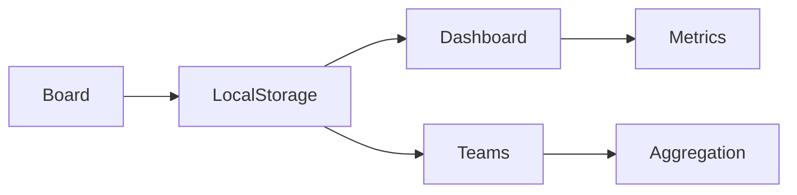
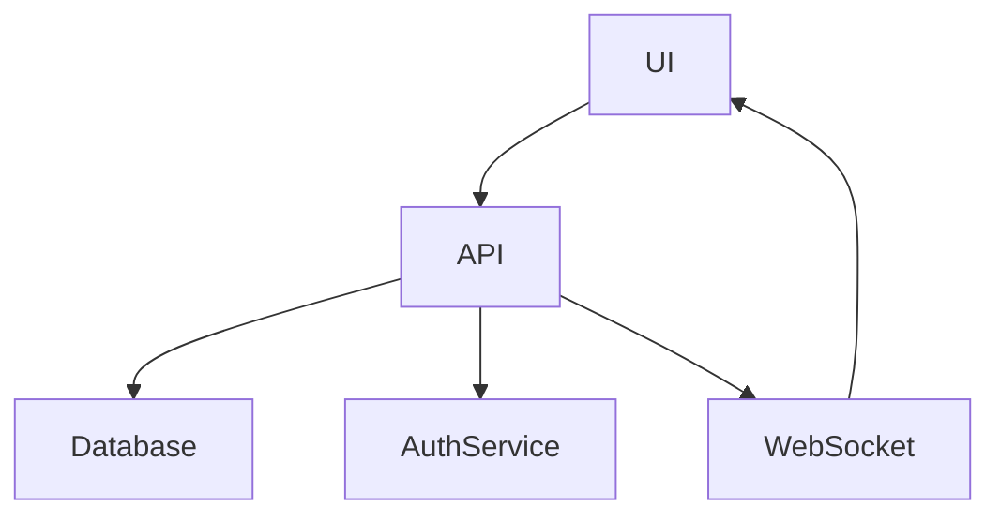

# 🚀 Smart Kanban

A modern SaaS-inspired Kanban system built with React, TypeScript and a scalable component architecture.

Live Demo:  
👉 https://davi-rio.github.io/smart-kanban/

---

## ✨ Overview

Smart Kanban is a modern project management interface inspired by Jira and enterprise SaaS platforms.

The goal of this project is to demonstrate:

- Clean UI/UX decisions
- Scalable front-end architecture
- Reusable components
- Modern React patterns
- State management using hooks
- Local persistence (localStorage)
- Modular page structure

This is not just a board — it's a complete mini SaaS interface.

---

## 🧩 Pages Implemented

### 📊 Dashboards
- KPI Cards (Total Issues, Backlog, In Progress, Completed)
- Status chart (dynamic based on board data)
- Recent activity section
- Sprint progress indicator
- Area filtering (Frontend, Backend, QA, DevOps, UX, Product)
- Dynamic connection with Board data

---

### 📋 Board
- Drag and drop (Dnd Kit)
- Multiple columns (To Do, In Progress, Done)
- Task creation modal
- Task editing
- Task deletion with confirmation modal
- Area filtering
- Search filtering
- Sprint support
- Local storage persistence

---

### 👥 Teams
- Team member cards
- Area-based filtering
- Dynamic task count per member (based on Board)
- Add new member functionality
- SaaS-style UI layout

---

### 🔌 Apps
- Connected vs Available integrations
- Connect / Disconnect functionality
- SaaS integrations layout
- Modular architecture for future expansion

---

## 🛠 Tech Stack

- React 18
- TypeScript
- Vite
- CSS Modules
- Dnd Kit (Drag & Drop)
- LocalStorage for persistence
- GitHub Pages for deployment

---

## 🎨 UI Philosophy

The UI is inspired by:

- Jira Cloud
- Linear
- Modern SaaS dashboards
- Minimal dark interface systems

Design decisions:
- Gradient dark background
- Soft hover animations
- Clean spacing
- Consistent card system
- Area-based visual grouping
- Reusable layout components

---

## 🧠 State Strategy

- Tasks stored in localStorage
- Centralized board state
- Derived data used by:
  - Dashboard KPIs
  - Teams task counts
  - Charts
  - Sprint progress

This simulates real SaaS cross-page state synchronization.

---

## 🚀 Deployment

Deployed via:

- Vite build
- GitHub Pages

npm run build
npm run deploy


---

## 🎯 Purpose

This project was created to demonstrate:

- Front-end architecture maturity
- UI/UX consistency
- Real SaaS design thinking
- Production-level structure for a portfolio

---

## 🔮 Future Improvements

- Backend integration (Node / NestJS)
- Authentication
- Multi-user system
- Database persistence
- Real-time updates
- API-driven dashboard
- WebSocket support
- Role-based permissions

---

## 👨‍💻 Author

Davi Rio  
Full Stack Developer  
Automation & Systems Engineering

---

## 📄 License

MIT

---

# 🏗 Architecture

Smart Kanban follows a modular and scalable front-end architecture, structured to simulate a real SaaS application environment.

---

## High-Level Architecture



---

## 🧠 Architecture Explanation

### 1️⃣ UI Layer

Responsible for layout and navigation:
- Sidebar
- Header
- Navigation between pages

This layer is presentation-focused and stateless.

---

### 2️⃣ Pages Layer

Each page is isolated and modular:

- DashboardPage
- BoardPage
- TeamsPage
- AppsPage

Each page:
- Consumes state
- Derives data
- Renders feature components

There is no tight coupling between pages.

---

### 3️⃣ Feature Components

Reusable components such as:

- Column
- Card
- NewTaskModal
- ConfirmDeleteModal
- MemberCard
- IntegrationCard

Encapsulated and independent.

---

### 4️⃣ State Layer

State is managed using:

- useState
- useEffect
- useMemo

Board acts as the **source of truth**.

Derived state feeds:

- Dashboard KPIs
- Teams task count
- Sprint progress
- Status chart

---

### 5️⃣ Persistence Layer

Tasks are stored in:

```
localStorage
```

This simulates backend persistence in a front-end-only environment.

---

## 🔄 Data Flow



Board is the mutation layer.  
Dashboard and Teams are read-only consumers.

This simulates a real SaaS pattern:

Central Data Source → Multiple Consumers

---

## 🧱 Architectural Benefits

- Modular design
- Clear separation of concerns
- Clean data flow
- Scalable structure
- Easily migratable to backend API
- Ready for Context API / Zustand / Redux
- Prepared for real backend integration

---

## 🚀 Future Evolution



This would enable:

- Multi-user system
- Real-time collaboration
- Role-based access control
- Advanced analytics
- External integrations
